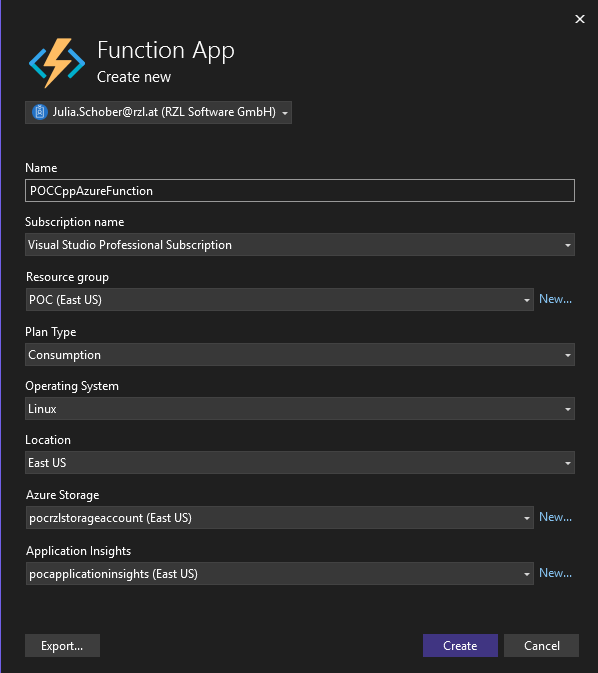

#  Azure Functions in Visual Studio (.NET + C++ DLL)

## Visual Studio Solution with DllImport 

### Prerequisites
- Visual Studio 2022 with:
  - ✅ Azure Development workload
  - ✅ Desktop Development with C++
- .NET 9
- C++ DLL (built for x64, Release)
- Azure Functions Core Tools (optional, for CLI testing)

### Steps to create 
1. Create a Visual Studio solution with the "Azure Functions" Template 
2. Copy the dll into the project folder 
3. Rename the Function1.cs file to your needs and add the static external functions from the dll which will be imported via DllImport 
4. For testing, start the project and click the function link to trigger the local function (e.g. http://localhost:7895/api/DllFunctionCalculate)


## Deploy/Publish Azure Function 
### Local Deployment 
1. Right click on the project and click publish 
2. Create a new profile and choose Azure -> Azure Function App 
3. Create a new function instance - if you do not already have a Resource Group, Storage Account and Application Insights, create them beforehand in the Azure Portal 
4. Create and Publish 

These settings can look like this: 



### Bicep File 
ℹ️ You can only test this with your personal subscription, you will not have permissions in the RZL tenant 

With a Bicep file, all Azure prerequisites can be deployed, as long as there is already a resource group existing. 
The created Bicep file provisions a Windows-based Azure Function App in westeurope, along with:
- a Storage Account
- an App Service Plan (consumption tier)
- an Application Insights instance
- GitHub Actions integration for CI/CD from the

The Function App is configured to run .NET 9 isolated worker.

#### Manually run Bicep file in Azure CLI 
To manually test the Bicep file and deploy the resources, following command can be executed in the Azure CLI - before the main.bicep file need to be uploaded to the cli so it can be accessed (if you are not running the cli locally)

``` sh
az deployment group create \
  --resource-group <your-resource-group> \
  --template-file main.bicep
```

### Deploy Azure Function with GitHub Actions 
ℹ️ Our RZL Azure Portal is not yet set up, so this only works with your personal subscription 

When the required resources have been deployed with the Bicep file, GitHub Actions can be used to deploy any Azure Function to the prepared Function App. 
A yml file (workflow) was created that performs the deployment. To be able to successfully run the action, follow these steps: 


#### Adjust yml file
1. When you want the action to be triggered on a feature branch, change line 6 to your branch name 
2. Adjust the app-name to your custom Function App if you renamed it in the Bicep file 

#### GitHub Repository Secrets 
Create a new secret with the name "AZURE_CREDENTIALS". This is necessary for the Azure login and to be able to access the Function App. To get the secret value, enter following command in the Azure CLI: 

``` sh
az ad sp create-for-rbac --name "my-github-action-deployer" --role contributor \
    --scopes /subscriptions/<your-subscription-id>/resourceGroups/<your-resource-group> \
    --sdk-auth
```

This will output a JSON block like:

``` json
{
  "clientId": "...",
  "clientSecret": "...",
  "subscriptionId": "...",
  "tenantId": "...",
  "activeDirectoryEndpointUrl": "...",
  "resourceManagerEndpointUrl": "...",
  ...
}
```

Copy the full json block in the secret. 