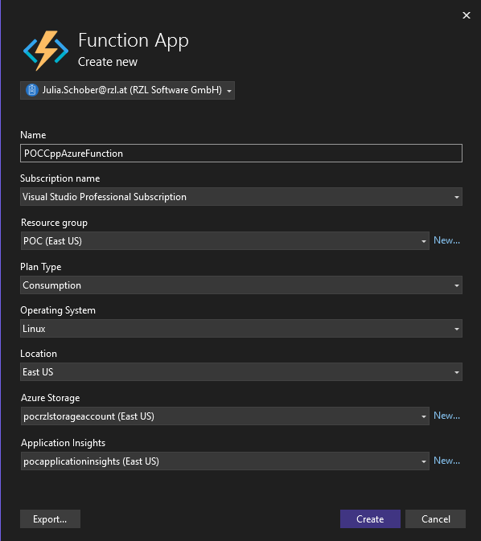

#  Azure Functions in Visual Studio (.NET + C++ DLL)

## Visual Studio Solution with DllImport 
### Prerequisites

- Visual Studio 2022 with:
  - ✅ Azure Development workload
  - ✅ Desktop Development with C++
- .NET 9
- C++ DLL (built for x64, Release)
- Azure Functions Core Tools (optional, for CLI testing)

### Steps to create 
1. Create a Visual Studio solution with the "Azure Functions" Template 
2. Copy the dll into the project folder 
3. Rename the Function1.cs file to your needs and add the static external functions from the dll which will be imported via DllImport 
4. For testing, start the project and click the function link to trigger the local function (e.g. http://localhost:7895/api/DllFunctionCalculate)

### Deploy/Publish Azure Function 
1. Right click on the project and click publish 
2. Create a new profile and choose Azure -> Azure Function App 
3. Create a new function instance - if you do not already have a Resource Group, Storage Account and Application Insights, create them beforehand in the Azure Portal 
4. Create and Publish 

These settings can look like this: 

### Testing Deployed Function 
To test the deployed function, call: https://poccppazurefunction.azurewebsites.net/api/DllFunctionCalculate and replace DllFunctionCalculate with your function name

## Adding Azure Function via Bicep 
Use Bicep for the deployment of: 

- Storage account 
- Function App (Windows or Linux)
- App Service Plan (Consumption, Premium, or Dedicated)
- App settings (like enabling 64-bit and .NET runtime)

The functionality can be published via GitHub Actions. 

